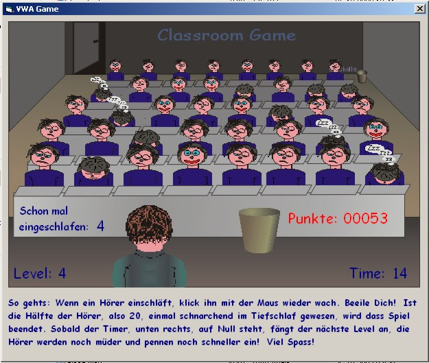



## A 2D Classroom Game

### Description

its your job as the teacher to prevent your pupils from falling asleep. click them with the mouse. thats all. i made the small game last saturday, a boring bad weather evening.

important: the sound module is from an other posting on planetsourcecode. it works great!

this is my first coding with vb graphics. does anyone know how to prevent the imageboxes from flickering, when loading another grafic into them? are there more professional ways to work with 2d grafics? sprites? api functions? please mail me your hints!

thanks.
 
### More Info
 
this is my first coding with vb graphics. does anyone know how to prevent the imageboxes from flickering, when loading an other grafic into them? are there more professional ways to work with 2d grafics? please mail me your hints!

thanks.

the sound module is from an other posting of planetsourcecode. it works great!

this is my first coding with vb graphics. does anyone know how to prevent the imageboxes from flickering, when loading an other grafic into them? are there more professional ways to work with 2d grafics? sprites? api function? please mail me your hints!

thanks.

             |
---                |---
**Submitted On**   |2003-10-26 16:13:18
**By**             |[CSkalla](https://github.com/Planet-Source-Code/PSCIndex/blob/master/ByAuthor/cskalla.md)
**Level**          |Beginner
**User Rating**    |5.0 (35 globes from 7 users)
**Compatibility**  |VB 6\.0
**Category**       |[Graphics](https://github.com/Planet-Source-Code/PSCIndex/blob/master/ByCategory/graphics__1-46.md)
**World**          |[Visual Basic](https://github.com/Planet-Source-Code/PSCIndex/blob/master/ByWorld/visual-basic.md)
**Archive File**   |[Classroom\_16638410272003\.zip](https://github.com/Planet-Source-Code/cskalla-a-2d-classroom-game__1-49473/archive/master.zip)

